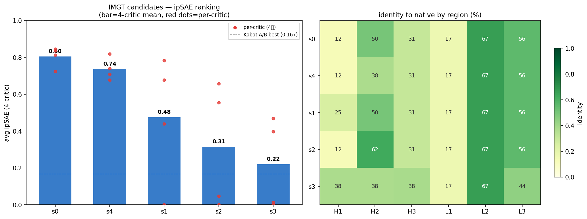
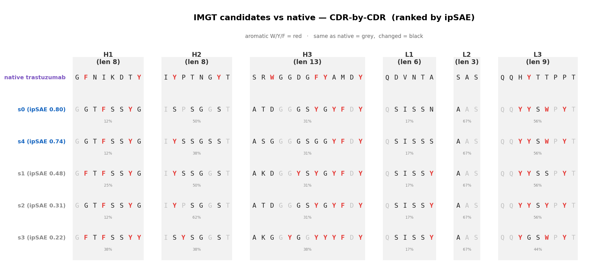

# 팀미팅 리포트 — ESM Binder Design: 문제 진단 → 개선 실험 → 결과

**날짜:** 2026-06-09 · **레포:** `esm_binder_design_base` (GitHub: Han00127, Private)
**한 줄:** 논문 Algorithm 11(ESMFold2 distogram-gradient 항체 CDR 설계)을 foundry baseline으로 재현하고,
**"설계가 비현실적이라 독립 평가에서 전이가 안 된다"** 는 핵심 문제에 대해 **자연 CDR 분포 prior(composition)** 를 도입.

---

## 0. TL;DR (핵심만)

| # | 문제 | 시도 | 결과 |
|---|---|---|---|
| 1 | 논문 충실 b\*(real ipTM)가 baseline보다 안 나음 | 저온 real confidence ipTM 정확 구현 | **개선 無** (0.122 vs 0.145). 설계모델 ipTM이 독립 critic으로 **전이 안 됨**(over-confidence) |
| 2 | "aromatic 범벅(50-70%)" 진단 | 실측|
| 3 | 설계가 **위치별로 비자연적** | **자연 CDR 분포 prior**(OAS+TheraSAbDab PSSM) 추가 | **CDR이 germline-같이 자연스러워짐** (nat_nll 4.7→0.8), 방향족 0.25→0.23 |
| 4 | composition을 KL로 했더니 **손실 폭발** | KL→**Cross-Entropy(프로파일 NLL)** | KL은 −H(p)가 annealing과 충돌해 폭발. CE는 안정. (단 KL도 gradient는 작동) |

**★ 검증 완료(핵심):** 자연성↑ → **4-critic 전이(avg_ipsae) 극적 상승.** best **0.145(baseline) → 0.44(KL) / 0.49(CE)**, mean **0.038 → 0.17/0.15**. **가설 입증** (§7). 단 **다양성 붕괴**(germline 수렴)가 새 과제.

---

## 1. 배경 / 목표

- ESMFold2의 **미분가능 distogram**을 gradient로 최적화해 고정된 항체 **Fv(VH+VL)에서 6개 CDR loop만 재설계**(framework·항원 고정; 모델 내부 folding은 scFv 형태로 입력). 설계된 CDR은 **scFv/Fv 어느 포맷에도 재사용** 가능.
- 논문 Algorithm 11 + 후처리 **4-critic ipSAE 랭킹**을 충실 재현 → **기준선(foundry)** 고정 후 개선.
- 평가: 생성된 설계를 **독립 critic 4종**으로 폴딩해 인터페이스 confidence(ipSAE) 측정.

### 1.1 아키텍처 한눈에 (Algorithm 11 + 우리 추가)

- **입력:** 항원(고정) + scFv(framework 고정 + CDR mutable). **init logits** → 매 step **softmax(x/T_k)** 로 soft 서열.
- **모델:** soft complex → **ESMFold2**(고온=distogram만 / 저온=+confidence head로 **real ipTM_k → b\***, ★우리 충실구현).
- **손실 = 구조 3종**(Inter/Intra/Glob, distogram 기반) **+ 시퀀스 prior**(LM masked-PPL **+ ★composition PSSM, 우리 추가**).
- **업데이트:** 성분별 gradient 정규화 → 결합 → **SGD** (cosine anneal로 K=150 반복) → **b\*** → **4-critic ipSAE 랭킹**.
- (빨간 테두리 = 우리가 추가/충실구현한 부분.)

### 1.2 주요 손실: 논문 원설계 → 항원-항체 접목

**큰 틀의 재정의** (모든 loss 변경의 이유)

| | 논문 (ESM binder design) | **우리 (항원-항체)** |
|---|---|---|
| **설계 대상** | 타겟에 결합하는 **새 미니 단백질 binder를 de novo**로 (체인 전체 신생성) | 고정된 항체 **Fv(VH+VL 가변도메인) 위에서 6개 CDR loop 영역만 재생성** |
| **산출물** | 새 binder 단백질 1개 | **재사용 가능한 6개 CDR loop** — scFv/Fv 어느 포맷에도 그래프트 가능 |
| **결합 상대** | 타겟 단백질 표면 전체 | 항원의 **지정 에피토프** |
| **자유도** | binder 전 잔기 | **CDR 잔기(mutable)만**, framework β-골격은 native 고정 |

> 모델 내부에서는 ESMFold2 folding을 위해 VH–linker–VL을 이은 **scFv 형태로 입력**하지만, **설계 자유도·최종 산출물은 6개 CDR loop**. 그래서 각 loss는 **수식은 그대로 두고 "적용 인덱스(범위)"를 항체 문맥으로 좁혔습니다** (binder 전체→CDR, target 전체→에피토프).

**손실별: 원설계 → 변경**

| Loss (논문 Alg) | 원래 설계 (de novo binder) | **항원-항체 접목 변경** |
|---|---|---|
| **Inter-contact** (12) | binder *전* 잔기가 타겟 표면과 confident contact (binder가 인터페이스에 묻힘) | target=**에피토프**, binder=**CDR 잔기**로 제한 → *"CDR이 지정 에피토프에 결합"* |
| **Intra-contact** (12) | 새 binder가 *스스로 접히도록* 내부 long-range contact 강제 (de novo folding) | framework는 native라 자명 → **CDR 잔기끼리(seqsep≥9)**에만 적용. 역할: *"CDR loop가 풀리지 않고 일관된 국소구조 유지"* |
| **Globularity** (13) | binder가 늘어지지 않고 globular하게 | **scFv 전체**의 기대거리 평균 억제 → CDR 재설계가 구조를 부풀려 비현실적이 되지 않게 |
| **LM masked-PPL** (14) | ESMC(범용 단백질 LM) pseudo-PPL로 서열 자연성 | CDR mutable 위치에 그대로. **단 범용 단백질 기준이라 항체 CDR 특유 분포는 못 잡음** ← composition의 동기 |
| **★ Composition** (우리 신규) | (논문에 없음) | **항체-특화 자연성**: OAS+TheraSAbDab 위치별 자연 CDR 분포(PSSM)에 대한 CE (섹션 4) |

**상세 설명**

- **Inter-contact — "CDR↔에피토프 결합 항"** (cutoff 20Å, 최근접 2개):
  각 CDR 잔기가 에피토프 잔기 중 **가장 가까운 2개**와 거리<20Å일 확률을 높이도록(−logP↓) 끎. **낮을수록 결합 강함.**
  - *원래:* binder 전체가 타겟에 묻히게 — 모든 binder 잔기에 적용.
  - *변경:* binder=CDR, target=에피토프로 좁혀 **CDR을 지정 에피토프 쪽으로 끌어당기는 결합 항**으로. 모든 에피토프와 접촉할 필요 없이 **최근접 2개만** 확실히 접촉(과도한 contact 강요 방지). cutoff 20Å로 느슨하게 둬 초기에도 gradient가 흐르게(좁히면 신호 없음).

- **Intra-contact — "CDR loop 자체 구조 항"** (cutoff 14Å, 최근접 2개, **seqsep≥9**):
  CDR 잔기끼리 **서열상 9잔기 이상 떨어진 쌍** 중 가장 가까운 2개와 거리<14Å일 확률을 높임. 낮을수록 내부 접촉 강함.
  - *원래:* 새 binder가 **스스로 접히도록**(de novo folding) 장거리 내부 contact 강제 — 풀린 구조 방지.
  - *변경:* framework는 이미 native fold라 자명 → **재설계된 CDR loop들이 서로/scaffold와 모순 없이 자리잡아** 풀리거나 비현실적으로 흩어지지 않게 하는 항으로. **seqsep≥9** 이유: 서열상 인접한 잔기는 당연히 공간적으로 가까우니(자명) 제외하고, **멀리 떨어진 잔기가 공간에서 가까워지는(=접히는) 의미 있는 신호**만 봄.

- **Globularity — "컴팩트한 덩어리 유지 항"**:
  단백질 도메인은 보통 **공처럼 둥글게 뭉친 컴팩트한 구조**(globular)로 접힘 — 반대는 **길게 늘어지거나 풀린(extended)** 형태. distogram 신뢰도만 좇으면 옵티마이저가 **CDR loop를 밖으로 비현실적으로 뻗치거나 구조가 퍼지는** 해를 찾을 수 있어 이를 억제.
  - *작동:* distogram→각 잔기쌍 **기대거리 = Σ P(d)·d**, scFv 전체 잔기쌍 평균 ÷ 22Å(정규화) = **회전반경(Rg) proxy**. 이 값을 낮게 유지 = *"퍼지지 말고 뭉쳐라."* (÷22Å은 −logP 스케일(0~3)과 거리 스케일(~18Å)을 맞춰 inter/intra와 균형 맞추는 정규화)
  - *항체 문맥:* Fv framework는 이미 globular하나, CDR 재설계가 loop를 비정상적으로 뻗게 하면 평균 기대거리↑ → glob이 억제해 **항체다운 컴팩트 loop 형태** 유지.

- **gradient 결합:** 각 loss의 gradient를 **성분별 L2 정규화**(구조는 √n) 후 λ로 가중 합산 → 스케일이 제각각인 손실을 같은 크기로 맞춰 결합. 현재 λ=(intra 0.5, inter 0.5, glob 0.2, LM 0.05, comp 가변).

  > **† 왜 성분별 정규화?** (`ĝ = √n·(g⊙m)/‖g⊙m‖`, Alg11 line24-25)
  > raw gradient는 손실마다 **크기·단위가 제각각**이라 그냥 더하면 큰 항이 update를 독점합니다 (예: 구조 ‖g‖~50 vs comp ~0.5 → comp는 λ를 키워도 묻힘). 각 성분을 **같은 norm(√n)의 방향 벡터로 표준화**해야 비로소:
  > 1. **λ가 진짜 상대 가중치로 작동** — `λ_LM=0.05` = "LM은 구조의 5% 세기로 민다"가 문자 그대로 성립.
  > 2. **annealing 내내 step이 α_k 하나로만 제어** — T 1→0.01로 raw gradient 크기가 step마다 수십 배 출렁여도 기여가 일정.
  > 3. **√n → 위치당 RMS≈1** — CDR 길이·개수가 달라도 잔기당 update 크기 동일 (같은 α_k가 통함).
  > 4. **가파른 6B 구조 gradient의 update 강탈 방지** — "방향 + 명시적 λ"로만 섞음. (ColabDesign/hallucination 표준 트릭)
  >
  > 
  > *왼쪽: 정규화 없이 → 큰 g_struct가 독점, composition 묻힘. 오른쪽: 같은 √n으로 표준화 후 λ 가중 → λ가 실제로 균형을 제어, comp가 update 방향을 꺾음.*

---

## 2. 문제 1 — 충실 b\*가 품질을 못 올림 (전이 실패)

- 논문대로 **저온(T<0.05)에서 real confidence head로 진짜 ipTM**을 뽑아 best 설계 선택(b\*)하도록 구현.
- in-loop ipTM은 0.07(proxy)→**0.30~0.46**(real)로 크게 상승. 하지만 **최종 4-critic avg_ipsae는 그대로**(0.122 vs proxy 0.145, 둘 다 단일-critic 아티팩트).
- **해석:** 최적화가 distogram뿐 아니라 **confidence head까지 적대적으로 속임** → 설계모델의 ipTM이 **독립 critic으로 전이 안 됨**(over-confidence). → 병목은 b\* 선택이 아니라 **설계 현실성**.


*(comp의 avg_ipsae는 랭킹 완료 시 갱신 — 자연성→전이 가설의 핵심 검증치)*

---

## 3. 문제 2 — "aromatic 범벅" 진단은 과장이었다 (정정)

- 초기에 설계 CDR을 보고 "W/Y/F 50-70% 범벅"이라 진단했으나, **실측하니 ~25%** (자연 항체 ~20%). 겨우 5%p 초과.
- → aromatic 과잉은 **주범이 아님**. 그러나 설계가 **위치별로 비자연적**(엉뚱한 위치·잔기)인 건 사실 → 이게 진짜 타깃.
- **왜 그래도 +5%p 초과했나 (원인):** 구조/contact loss의 목표는 *"confident contact를 강하게 만들어라"*. 방향족(W/Y/F)은 **크고 평평한 소수성 곁사슬**이라 넓은 접촉면 + π-stacking으로 구조 예측기가 **거리를 짧고 확신 있게(낮은 −logP)** 예측 → **구조 신뢰도만 최적화하면 인터페이스/contact 위치에 aromatic을 살짝 과선택**하는 편향이 생김. (AlphaFold hallucination / ColabDesign에서 잘 알려진 현상 — 예측기가 "좋아하는" adversarial 서열이 aromatic·hydrophobic-rich로 치우침.) LM prior(ESMC)만으론 약해서(λ=0.05, 게다가 범용 단백질) 못 막음 → **composition prior**가 위치별 자연 분포로 교정하며 0.25→0.23으로 정상화(섹션 6.1).

---

## 4. 변경 — 자연 CDR 분포 prior (composition)

**아이디어:** 설계 CDR의 **위치별 AA 분포**가 *자연 항체 분포*에서 벗어나면 페널티.
- 손실: `L_comp = mean_pos( cross-entropy(p_pos, q_pos) )`. q_pos = **위치별 자연 분포(PSSM)**.
- **데이터 파이프라인:**
  - **TheraSAbDab(1,134) + OAS paired(60만)** VH/VL 서열을 **ANARCI(IMGT 넘버링)** 로 정렬,
  - 설계 CDR 위치를 같은 IMGT 위치에 매핑해 자연 AA 빈도 집계 → `q_target.npz` (위치당 support ~32,000).
  - OAS는 firewall 때문에 **Colab→Drive→노드** 로 확보. 넘버링은 별도 env(bioconda anarci)에서.

### 4.1 `.npz`에 뭐가 들었고, 어떻게 loss가 되나 (상세)

**(1) `.npz` 만드는 과정**
```
64,523개 자연 항체(OAS+TheraSAbDab) VH/VL
   → ANARCI 로 IMGT 넘버링 (서열마다 각 잔기에 IMGT 번호 부여)
   → 우리 설계 CDR 58개 위치를 같은 IMGT 번호에 매핑
   → 각 위치에서 20-AA가 몇 번 나왔는지 카운트 → 정규화
   → q_pos[i] = 위치 i 의 "자연 AA 확률분포" (합=1)
```

**(2) `q_target.npz` 내용물**
| 키 | shape | 의미 |
|---|---|---|
| `q_pos` | **[58, 20]** | **★ 위치별 자연 분포 q** (행 i = 위치 i, 20 AA 확률, 합 1) |
| `q_global` | [20] | 전체 CDR 평균 분포 (방향족 0.195) |
| `support` | [58] | 위치별 기여 항체 수 (~32,000) |
| `aa_order`, `cdr_names` | — | AA 순서 / 각 위치의 CDR 라벨 |

→ **이 `q_pos`가 곧 PSSM** (아래 히트맵). 위치마다 자연에서 어떤 AA가 흔한지.


- 밝은 노랑 = 그 위치에 **한 AA가 지배적**(보존 위치, 예: 어떤 위치는 S/Q/I가 ~0.9).
- **H3 구간(20~30)은 어둡고 퍼짐 = 다양**(어느 AA든 가능). → 위치마다 분포가 완전히 다름.

**(3) p vs q — loss 계산**
- **q = 자연 분포(타깃, `.npz`, 고정)** / **p = 우리 설계 분포 = softmax(x/T)** (매 step 변함, 위치마다 20-벡터).
- 손실: 위치별 **Cross-Entropy** `CE(p, q) = −Σ_a p_a · log q_a`, 전 위치 평균.
- gradient가 설계 logits x를 갱신 → **p를 q(자연)쪽으로** 끎.


- **보존 위치(L1 #33):** q가 S에 ~0.99. 설계가 S 고르면 `−log q = 0` (손실 거의 0) → 쉽게 자연 따라감.
- **다양 위치(H3 #21):** q가 G(0.16)·R(0.11)·… 로 퍼짐. **comp는 G(−log q=1.8, 저손실)**, **no-comp는 V(−log q=3.0, 고손실)**. → comp가 자연에서 흔한 AA를 골라 손실↓.

> 즉 loss는 "설계가 각 위치에서 **자연에서 흔한 AA**를 고르도록" 압박. (q에 이미 자연 수준 다양성이 들어있어, 보존 위치는 강하게·다양 위치는 느슨하게 규제됨.)

---

## 5. 문제 3 — KL은 폭발한다 → Cross-Entropy

- `KL(p‖q) = CE(p,q) − H(p)`. 우리 p=softmax(x/T)는 annealing으로 **one-hot이 되며 H(p)→0**.
- KL의 `−H(p)` 항은 "p를 넓게 유지"를 강요 → **annealing과 충돌, 저온에서 폭발**.
- **CE(프로파일 NLL)** 는 엔트로피 항이 없어 안정 — "고른 AA가 자연에서 흔하게"로 깔끔하게 작동. (LM masked-PPL과 동형.)
- *경험적 메모:* KL도 **gradient 방향**은 자연 AA로 끌어서 **결과 설계는 자연스러웠음**(값만 폭발). → KL vs CE A/B로 실제 품질 차이 검증중.

---

## 6. 결과 — composition이 설계를 자연 항체로 끌어옴

### 6.1 방향족 분율: 자연 수준으로 하강

- no-comp 0.25 → **comp 0.23** (자연 0.195쪽). 분산도 감소.

### 6.2 위치별 자연성(NLL): 극적 개선

- no-comp **4.7** → comp **0.82** (낮을수록 자연). **native trastuzumab(2.03)보다도 낮음** = 매우 germline-같음.

### 6.3 CDR 서열: 정성적으로 "진짜 항체"

- no-comp: `TSLNQWFYTYYWWSPP…` (정체불명) → comp: `GFTFSSYYMS·…·RASQSISSYLY·…·QQYNSLPLT` (**germline canonical 패턴**).

**CDR별(H1~L3) 비교** (방향족 W/Y/F = 빨강):

- **comp이 영역별로 germline canonical 패턴** 회복: H1 `TFSSYYMS`(GFTFSSYYMS germline), L1 `RASQSISS…`, L2 `AASSRAS`, L3 `QQ…PLT`.
- **no-comp는 영역 무시한 방향족 배치**: 예 **L2 `AYWWSAT` 43%**(자연 L2는 방향족 거의 0!), H2 33%. → comp이 *영역별 자연 분포*를 복원.

### 6.4 솔직한 caveat
- comp 설계가 **native보다 더 "전형적"(nat_nll 0.82<2.03)** = **germline 수렴** 신호. 자연스럽지만 **다양성↓·epitope 특이성 의문**.
- → **λ_comp 튜닝**(너무 세면 germline 복붙), **다양성 측정** 필요.

---

## 6.5 길이층화 자연 통계 (variable-length 설계 기반 데이터)

다음 단계(**trajectory마다 CDR 길이 다양화**)를 위해 자연 항체 12만개에서 **길이 분포 + 길이별 PSSM + 방향족 함량**을 사전 구축 (`data/length_pssm.npz`, 56개 길이별 PSSM).

### 길이 분포

| CDR | 최빈 | 특성 |
|---|---|---|
| H1 | 8(81%) / H2 | 8(61%) — **거의 고정** |
| **H3** | **15(11%), 5~30 넓음** | **다양성 엔진 → 가변길이 핵심** |
| L1 6(50%) / L3 9(46%) | 부차 변동 | / **L2 3(99%) 사실상 고정** |

→ 가변길이는 **H3 우선**, H1/H2/L2는 고정해도 무방.

### H3 길이별 PSSM (같은 H3라도 길이마다 분포 다름)


### ★ 방향족(W/Y/F) 함량 — 길이별

- 중쇄(H1/H2/H3) > 경쇄. **L2는 거의 0**(Ser 도배).
- **H3: 길수록 방향족↑(0.13→0.24), 거의 전부 Tyr** (Tyr 0.065→0.20; Trp 낮고 평평, Phe 중간).
- **함의:** 긴 H3는 자연적으로 Tyr-rich → 길이별 PSSM이 이를 반영해야 정확한 자연성 타깃.

---

## 7. ★ 결과 — composition이 critic 전이(ipSAE)를 3배 올림 (핵심 검증)

**30개씩 생성 → 4-critic ipSAE 랭킹** (baseline=이전 12개, comp=각 30개).

| batch | best ipSAE | mean ipSAE | naturalness NLL | pLDDT | 다양성(identity↓=다양) |
|---|---|---|---|---|---|
| baseline (no comp) | 0.145 | 0.038 | 4.95 | 74.4 | **0.33 (다양)** |
| **KL-comp** | 0.440 | **0.174** | 0.82 | 81.9 | 0.86 |
| **CE-comp** | **0.488** | 0.154 | 0.89 | 81.2 | 0.84 |


### 7.1 핵심 발견
1. **★ 자연성 → critic 전이 입증.** composition으로 설계를 자연화하니 **avg_ipsae가 baseline 대비 best 3배(0.145→0.44/0.49), mean 4.6배(0.038→0.17)**. "설계가 독립 critic으로 전이 안 되던" 병목이 **자연성으로 해소**.
2. **진짜 합의(consensus).** 최고 설계 **CE s108: 4 critic 모두 0.38~0.66** (baseline은 늘 1 critic만 반응하는 아티팩트였음). → 단일-critic 운이 아니라 **독립 모델들이 동의**.
3. **구조 신뢰도↑.** pLDDT 74→82.
4. **자연성↑.** nat_nll 4.95→0.85 (native 2.03보다도 낮음).

### 7.2 ★ 새 과제 — 다양성 붕괴 (germline 수렴)
- comp 30개가 **서로 84~86% 동일**(baseline 33%). = **germline consensus로 수렴** → 사실상 비슷한 설계 30개.
- 원인: composition이 *각 위치의 최빈 자연 AA*로 강하게 끎. → **품질↑ but 다양성↓** trade-off.

### 7.3 KL vs CE
- **거의 동등.** CE가 **단일 최고**(0.488 vs 0.440)·방향족 약간↓(0.213 vs 0.229)·미세하게 더 다양. KL이 **평균**(0.174 vs 0.154)·자연성 약간↑.
- **KL 손실값 폭발은 최종 품질에 무해**(gradient 방향이 자연 AA로 끌어서) — 단 CE가 곡선 안정·해석 용이해 **CE 권장**.

---

## 8. 다음 단계

1. **★ 다양성 회복 (최우선):** germline 수렴 완화 — **λ_comp 튜닝**(약하게), **variable CDR length**(H3 길이 trajectory별 샘플링 → 길이로 다양성 강제; 길이층화 PSSM 이미 구축됨 §6.5), 또는 다양성 보상 항.
2. **loss-rebalance:** λ_glob/intra↓ + per-CDR 가중치(H3 집중).
3. **항체 LM prior(AbLang2/IgLM):** 위치+문맥 자연성(composition 상위호환) — 위치 marginal보다 다양성 보존 가능성.
4. **검증 확대:** 더 많은 항원/타깃, ipSAE 외 지표(DockQ 등), 실제 발현·결합 검증.

---

## 9. ★ IMGT 좌표 전환 + 검증  `(작업: 2026-06-12)`

**동기 — 좌표 불일치 해소.** 설계는 Kabat(서열인덱스) CDR 정의, 자연 데이터(length PSSM)는 IMGT라 **서로 다른 좌표**였음 (같은 H3라도 IMGT len 13 = Kabat len 11). → 모든 것을 **IMGT 단일 좌표**로 통일하고, mutable은 IMGT-CDR 안에서 명시 선택하는 방식으로 전환.

**구축한 IMGT 라인 (2026-06-12):**
- `configs/trastuzumab_her2_imgt.yaml` — IMGT-CDR mutable **47위치** (Kabat 58 → IMGT 47; CDR2가 IMGT선 짧음)
- `data/trastuzumab_qtarget_imgt.npz` [47,20] — IMGT 위치 composition
- `data/length_pssm_full.npz` — IMGT 전체 60.2만, **78 strata** (가변길이용; §6.5 subsample 56 → full 78)

**★ 결과 — ipSAE가 역대 최고.** IMGT 설계(K=100, 5traj, compile) → 4-critic ipSAE 랭킹:



| | IMGT (5후보) | Kabat CE A/B |
|---|---|---|
| avg_ipsae 평균 | **0.510** | 0.054 |
| 최고 | **0.805 (s0)** | 0.167 |

- **s0(0.80)·s4(0.74)는 4개 독립 critic 전부에서 0.72~0.85** — 단일 critic 아티팩트가 아닌 **robust한 고품질 인터페이스**. 이전 Kabat 30traj best(~0.49)도 상회.
- **가설:** mutable이 47개로 적어 framework·canonical CDR을 더 native로 유지(특히 **L1 RASQ 앵커가 IMGT-L1 밖이라 자동 보존**) → native fold에 가까워 독립 critic 전이↑.
- **identity ≠ ipSAE:** s0(0.80)·s3(0.22) 둘 다 native-identity ~36-38%로 동일 → **품질은 native 유사도가 아니라 구조 전이성에 달림** (위 figure 우측 heatmap: region별 identity는 후보 간 거의 동일).

**caveat:** n=5, K=100 (소표본). 확정엔 trajectory 확대 재현 필요. s1~s3은 일부 critic 0.000(fold 실패)이라 robust한 건 s0·s4.

**부수 효과:** Kabat↔IMGT 불일치 해소 + 가변길이 설계 기반(IMGT length PSSM) 확보.

### 9.1 생성 서열 분석 — "서열 변화 ≠ 구조 변화"  `(작업: 2026-06-12)`

s0~s4를 native와 region별로 비교:


*(회색=native와 동일, 검정=변경, 빨강=방향족. H1은 5개 다 `GGTFSSYG`로 수렴, L2는 전부 `AAS`, H3는 후보마다 다름.)*

**의문:** H3가 항원결합 핵심 loop인데 왜 **identity는 H1·L1이 가장 낮나?** (H1 12%, L1 17% vs H3 31%)

**답 — 서열 identity와 구조 변화는 다른 축:**
- **트라스투주맙은 humanized 항체** (인간 framework + **murine 4D5 CDR graft**). H1/L1 native 잔기는 murine 유래라 **인간 germline consensus와 멂.**
- H1/L1은 germline-encoded라 자연계 **보존적 → PSSM이 sharp → composition이 consensus(예: H1→`GFTFSSY`)로 강하게 끎** → murine native에서 멀어짐 → **서열 identity 최저.**
- H3는 자연계 **hypervariable → PSSM이 flat → 위치별 끄는 힘 약함** → 구조 손실이 주도, 단일 consensus 없어 native서 *덜* 끌려감 → identity 중간.

| CDR | 서열 identity | 구조 변화(Cα RMSD, §s108) | 해석 |
|---|---|---|---|
| **H1** | 최저 12% | 작음 1.2Å | 서열 re-germline화(잔기 확 바뀜) but **backbone 유지**(같은 canonical fold) |
| **H3** | 중간 31% | **거대 3.8Å** | 서열 덜 바뀌나 **backbone 대변동** ← 진짜 항원결합 적응 |

→ **literature대로 H3가 구조적으론 가장 크게 변형(핵심 binding).** identity(서열) 지표가 H1/L1을 더 낮게 보이게 한 건 **composition의 re-germline화** 때문이지 H1이 더 중요해서가 아님. **identity는 ipSAE도 예측 못 함**(s0 0.80·s3 0.22 둘 다 ~37% identity) — 품질은 native 유사도가 아니라 구조 전이성.

---

## 부록 — 파이프라인
```
config → run.py: scFv 조립 + 인덱스
  → [생성] Algorithm 11: soft→ESMFold2 distogram→구조손실
        + ESMC LM prior + composition(자연 CDR 분포) → SGD → b*
  → [선택] 4-critic ipSAE 랭킹 → 최종
```
재현/데이터: `build_pssm.py`(PSSM), `download_oas_colab.py`(OAS), `composition.py`(손실), wandb `ESMCRAFT`.

---

## 10. ★ 다중항원(quaternary) 설계 확장 — STEAP1 trimer  `(작업: 2026-06-13)`

**동기.** 기존은 단일 항원만 지원. STEAP1처럼 **homotrimer 꼭대기(apex, 3-fold 축)에 형성되는 quaternary epitope** — 한 항체가 **여러 protomer를 동시에** 물어야 하는 타깃을 설계 대상으로 확장.

### 10.1 새 손실 `inter_modes` — quaternary coverage (`losses.py`)
하나의 paratope가 지정 chain 집합을 **동시 결합**하도록 강제 (★합성 검증으로 결함 2개 발견·수정, §10.3):
- **Best-kb coverage (chain별):** g를 *가장 잘 무는 kb개* binder 잔기 평균. ★"모든 binder 평균"이 아니라
  best-kb라 **분업**(어떤 잔기는 A, 어떤 잔기는 B 접촉)을 허용 — apex처럼 한 loop가 여러 protomer에 나눠
  닿는 걸 인정.
- **pull + tight 이중 cutoff:** pull(20Å)은 멀어도 gradient 흐름, **tight(10Å)는 조밀 apex에서 단일-protomer
  결합을 진짜로 구분**(모든 게 20Å 내라 pull만으론 구분 불가 — 이게 핵심 결함이었음).
- **bottleneck(softmax worst-chain) + softmin over modes:** mode 내 chain은 AND(worst를 끌어올림), mode들은
  OR(homotrimer 대칭 seam 자유선택). **단일 chain mode면 기존 `inter_contact`와 수치 동일**(하위호환 검증).
- co-localization은 **기본 off**(조밀 apex의 자연 분산을 과벌 → 단일-protomer가 더 좋아 보이는 결함 유발).
  서로 멀리 떨어진 비-조밀 epitope에서만 옵션으로.
- config `antigen.chains[]`(+per-chain `epitope`) / `binding_modes`. iptm·rank도 mode-aware(`max_modes(min_chain)`).

### 10.2 ★ crop 검증 — cropped trimer가 native apex를 재현
- 전장 trimer는 gradient 시 **L≈1298 → 80GB OOM**(천장 실측 **L≈420**; activation 주범=`_esmc` LM 80블록). `device_map` 멀티GPU는 forward가 cross-device `cat`이라 **막힘**.
- **crop(각 protomer 73–325; N-term/C-term 세포질만 제거, 6-TM+ECL1/2/3 유지)** 의 antigen-only fold → **A/B/C 완벽 C3 대칭(쌍별 contact 59, min 5.1Å), epitope 패치 apex 수렴(중심 9.7–14.3Å, cross-chain 최소 5.9–7.8Å), ipTM 0.78.** → **crop이 native quaternary apex를 충실 재현** 확인. (`data/make_crop_config.py`, `report/check_apex.py`)
- 메모리 레버: `model_hooks` `ESMC_CKPT=1`(LM 블록 checkpointing) opt-in 추가 — crop L≈1001을 단일 GPU에 넣기 위함(검증 대기 중).

### 10.3 손실/설계 점검 결과  `(2026-06-15)`

**1. ★ `inter_modes` 합성 검증 — 결함 2개 발견·수정** (`report/verify_inter_modes.py`, 답을-아는 distogram).
- (결함 a) coverage가 *모든* binder 잔기 평균이라 **분업**(잔기별 다른 chain 접촉)을 과벌.
- (결함 b) co-localization이 apex 자연 분산을 선형 과벌 → **단일-protomer 결합(full 1.40)이 3-chain 도달(6.68)보다 점수 좋음** = 결정적 결함.
- **수정**: best-kb coverage(분업 허용) + tight-cutoff 항(조밀 apex 구분) + co-loc off. → singleA가 apex·spread보다 **+18.1 높음**(특이성 확보), spread<singleA, 하위호환(단일=inter_contact) 유지.

**2. Paratope 도달성 & ★ H3-only 확정** (`report/analyze_paratope_reach.py`). footprint diameter 22.6Å이나
이는 **전체 커버 기준**이고, 우리 손실은 전체 커버가 아니라 **각 chain의 key 잔기 몇 개씩만 접촉**을 요구
(`cov_best(kb,num)`: H3가 *알아서 고른* kb개 잔기가 각 chain의 가까운 num개 epitope에만 닿으면 valid). 올바른
지표는 **도달성**: geometric-median에서 각 chain 최근접 **≤5.0Å**, 세 패치 circumradius **7.4Å** — 한 작은
영역(반경 ~7Å)에서 셋 다 닿음 → **13잔기 H3로 충분히 가능 → H3-only 확정**(binder_idx 확장·multi-CDR 불필요).
다이얼 `(kb,num)`=각 chain 접촉 잔기 수, **기본 kb=2,num=2**(1잔기 단독=허상 위험, 3=빡빡 → 2가 균형).
*친화도 부족 판명 시에만* H1/H2 개방으로 escalation. (합성검증: key 잔기만 닿아도 0.55, 단일=18.7)

**3. Negative design** (`run.py --neg-design --neg-lambda`). 저온 b* = `ipTM(trimer) − λ·ipTM(monomer 첫 protomer)` → **trimer 특이성**(monomer 비결합) 강제. opt-in(저온 fold 2배). *주의: 단일 protomer가 trimer 형태로 안 접히면 neg 신호 약할 수 있음 — GPU 확보 후 실측 필요.*

> **소수-접촉이 "진짜 결합"임을 보장하는 건 inter loss가 아니라** tight cutoff(진짜 접촉) + negative design(trimer 특이성) + independent critic 랭킹(전이)의 분담. inter는 방향만 끌고 현실성은 downstream이 검증.

### 10.4 남은 일 (GPU 대기 중)
- `ESMC_CKPT` probe(crop L≈1001 단일 GPU 적합성) — 8장 포화로 미실행, waiter(`b88y7fm76`) 대기 중.
- 통과 시 바로: crop config(`steap1_trimer_crop73_325.yaml`)로 **H3-only quaternary 설계**(K=150, `--neg-design`, kb=2/num=2) 실행 → 4-critic 랭킹.

---

## 11. ★ Quaternary 실험 2건 + apex-binder 방향  `(2026-06-16)`

### 11.1 실험 결과
| | 실험1 (GPU0, trastuzumab) | 실험2 (GPU1, 실제 anti-STEAP1 VH) |
|---|---|---|
| scaffold | trastuzumab, H3 13잔기 | anti-STEAP1 VH(Fv) + trastuzumab VL, **H3 8잔기 [99,107]** |
| 규모 | 5 traj×K150 | 10 traj×K150 |
| 손실 | recycle-nograd + quat(per-chain) + L_LM + L_comp | 동일 |
| 평가 | crop fold | **풀 STEAP1 trimer fold** |
| 결과 | crop ipTM 0.16, pLDDT 0.56(조립 부실) | global ipTM 0.57–0.65, **s2 A·B·C 다 접촉(quaternary)** s1/s3 2개 |

### 11.2 핵심 학습
1. **crop fold 신뢰도 낮음** → **풀 antigen 평가가 맞다.**
2. **global ipTM 미끼** — 0.57은 trimer 자기조립(A-B-C 0.44); **binder↔protomer ipTM ~0.15로 약함.** ipSAE=0.
3. **H3-only(8–13잔기) 계면 약함.** s2는 물리적으론 3-protomer 접촉(quaternary 달성)이나 confident binding 아님.
4. **메모리:** OOM 주범 = msa_encoder×recycle 2-pass(6B LM 아님). `RECYCLE_NOGRAD`로 −15GB(forward 동일). 단일 GPU L≈1001 비현실 → crop+recycle-nograd로 L~590.

### 11.3 quaternary 아이디어 valid? → 손실·파이프라인 valid, 산출물 약함
- 손실 옳음(합성검증 단일<3-chain margin +18, per-chain 균등접촉 확인), 파이프라인 작동(s2 실제 3-protomer 접촉).
- **그러나 H3-only 계면 약함.** ★ **distogram-contact는 proximity 신호지 affinity 아님** — 설계모델이 "닿았다"(낮은 inter loss) 예측해도 독립평가선 약함(ipSAE0). proximity는 필요조건이나 불충분.

### 11.4 8UCD급 apex binder 방향 (우선순위)
- **A. paratope 확장(최우선):** H1+H2+H3 개방 / 긴 H3(가변길이). 8잔기로 22.6Å apex strong 결합 불가.
- **B. 타깃 geometry 정확화:** 조립검증된 crop(73-325, ipTM0.78) 또는 풀 trimer.
- **C. 8UCD scaffold 활용:** de novo 대신 실제 anti-apex 항체 위에서 affinity 최적화.
- **D. 선택 지표:** per-chain biptm + (trimer−monomer 특이성). global ipTM/ipSAE 아님.
- **E. (피봇) C3-대칭 de novo binder:** apex 3-fold 대칭에 항체보다 대칭 미니단백질이 자연스러울 수.

---

## 12. ★ per-CDR target + 메모리 벽 = 접근 재설계 필요  `(2026-06-16)`

### 12.1 per-CDR target 프레임워크 (실제 8UCD-style contact map 기반) — 기계는 작동
- 논문 Fab–STEAP1 trimer **interaction map(CSV)** → CDR별 {chain: 항원잔기} 자동 파싱 → config.
  결과: **H3→A·B·C(quaternary), H1·L1→2-chain, L2→B·L3→C(1:1)**, H2 미접촉. (`data/build_cdr_target_config.py`)
- CDR 위치는 **ANARCI IMGT**. 손실 = **Σ_CDR w_CDR·inter_modes(CDR잔기, target chain들)** — 단일=1:1(inter_contact),
  다중=quaternary coverage를 **한 메커니즘으로 통합**. 멀티-CDR(39잔기) 동시설계 = paratope 확장 자동 달성.
- composition도 5 CDR 각자 길이별 PSSM으로 정상 작동(q_target 39위치). dry-run·smoke 검증.

### 12.2 ★ 그런데 멀티-CDR도 H3-only와 같은 천장 → 병목은 CDR 아님
- 멀티-CDR / H3-only **둘 다 full-antigen biptm ~0.2–0.27 정체.** CDR 개수 문제 아님.
- inter-only 진단(comp/LM off): comp가 **일부** 방해(17→12)하나 **inter gradient 자체도 약함**(comp 없이도 안 내려감).

### 12.3 ★★ 진짜 병목 = 설계 crop이 apex 조립을 못 함 (+ 메모리 벽)
- **crop 조립 스캔**(antigen-only fold): 116aa(145-260) pLDDT0.37 실패, 181aa(145-325)도 실패,
  **101-325(225aa)부터 조립**(ipTM0.78, C3대칭, epitope 12.8Å). → **apex엔 ECL1+ECL2+ECL3+TM bundle ≈ 225/protomer 필수.**
- 조립 crop 225aa → **설계 L=917.** gradient OOM:
  | | 결과 |
  |---|---|
  | 1-GPU(recycle-nograd) | 천장 L≈620 |
  | 2-GPU(offload+ckpt+chunk8) | L=850 OOM |
  | 3-GPU(offload 분산) | **L=917 OOM** |
- **★ working-set 벽:** OOM은 saved-overflow 아니라 **cuda:0의 live working-set**(연산 중 텐서). offload 불가
  (연산이 한 GPU). GPU 늘려도 안 됨 → model parallelism(layer 분할) 필요한데 device_map은 cross-device cat으로 막힘.
- **결론: "조립되는 apex crop"의 distogram-gradient 설계는 현 하드웨어(1/2/3-GPU)로 불가.**

### 12.4 검증된 메모리 사실 (재현용)
- OOM 주범 = msa_encoder × recycle 2-pass (6B LM 아님, detach라 0.3GB). `RECYCLE_NOGRAD`(앞 recycle no_grad)
  = 무손실 −15GB. checkpoint/chunk/offload는 메모리↓·속도↓ (working-set은 chunk만, saved는 offload/recycle/ckpt).
- 랭킹/critic은 **no_grad라 full antigen(L1298) fit** → 평가는 항상 full로(설계만 crop).

### 12.5 ★ 접근 재설계 방향 (devel 재출발용)
- **(1) generate-and-select:** 작은 crop(메모리 OK)에 대량 생성 → **전부 full antigen no_grad 랭킹**(메모리 OK)
  → per-chain biptm 선별. 생성은 싸게, 품질판정은 정확히. 메모리 벽 우회. (※ 현 천장 ~0.27이 대량생성으로 깨지나 검증 필요)
- **(2) model parallelism:** ESMFold2 forward를 device-aware로(cross-device cat 정렬) → 큰 엔지니어링.
- **(3) de novo C3-대칭 binder:** 항체 CDR 설계 대신 apex 3-fold에 맞춘 대칭 미니단백질(RFdiffusion 등).
- **(4) 더 작은 타깃:** quaternary 포기, 단일 protomer epitope 설계(메모리 OK)부터.

**한 줄:** per-CDR 기계·평가 파이프라인은 검증됨. 하지만 **조립되는 STEAP1 apex는 gradient 설계 메모리를 초과**해서,
같은 crop-on-GPU 경로로는 막힘. → generate-and-select 또는 model-parallel/de-novo로 **devel에서 재설계** 권장.

## 13. ★ 자연 H3(len14) 방향족 프로파일 vs AMG 509 — composition prior 타깃 검증  `(작업: 2026-06-17)`

**배경:** 초기 naive 설계의 "방향족 과다" 문제를 정량 기준으로 잡기 위해, `length_pssm_full.npz` 의
**`H3__14` strata**(자연 항체 H3 길이14의 위치별 분포)에서 방향족(F/W/Y) 분포를 분석하고 AMG 509 H3와 비교.

### 13.1 방향족 아미노산 정의
- 엄밀(고리 보유) **4종**: Phe(F)·Tyr(Y)·Trp(W)·His(H). 그중 **F/W/Y = 강한 방향족**(UV·π-stacking), His는 약함.
- 본 분석/코드는 관례대로 **F/W/Y 3종**으로 카운트 (His 포함해도 H3 len14엔 H가 거의 없어 결론 동일).

### 13.2 자연 H3(len14) 방향족 = 평균 **19.9%** (14잔기 중 ~2.79개), C말단 집중
- 위치별 F+W+Y 기대비율: **pos1-2 ≈ 0%**(A·R 앵커) → 점증 → **pos11 36%·pos12 63%·pos14 52%**.
- 최빈 패턴: pos1 **A(88%)**, pos2 **R(63%)**, pos12 **F(59%)**, pos13 **D(86%)**, pos14 **Y(49%)** = 전형적 `AR…FDY` J-region 모티프.

### 13.3 AMG 509 H3(TRWGYYGTRGYFNV) = **35.7%**(5/14) = 자연 평균의 **1.79배**
| AMG509 위치 | 잔기 | 자연 그 위치 빈도 | 순위 | 평가 |
|---|---|---|---|---|
| pos3 | **W** | 0.8% | **18/20** | ★ 매우 비전형 (자연 최빈 D 25%) |
| pos5 | Y | 10.2% | 3/20 | 중간 |
| pos6 | Y | 10.3% | 3/20 | 중간 |
| pos11 | Y | 23.8% | **1/20** | 자연 consensus 일치 |
| pos12 | F | 58.9% | **1/20** | J-region 앵커, 완전 일치 |

- **C말단 앵커(11 Y, 12 F)는 자연 최빈과 정확히 일치** = 정상적 방향족.
- **비전형성은 pos3 W에 집중** — 자연에선 0.8%(18위)인 자리에 Trp. pos5·6 Y도 평균보다 더 채움.
- pos14는 AMG509=V인데 **자연은 Y 49%** → 오히려 C말단 방향족 하나를 **놓침**.
- 즉 AMG509의 35.7% = "자연 앵커(11·12) + N말단쪽 추가 방향족(3·5·6)".

### 13.4 의미 — composition prior의 타깃이 곧 이 프로파일
- 우리 composition(KL/CE)은 설계 시 **이 위치별 자연 분포로 끌어당김** → naive 과다 방향족 억제.
- AMG509식 **pos3 W**처럼 드문 위치의 방향족은 prior 관점에서 **강한 페널티**(자연 빈도 낮음). 실제 결합 항체가
  자연 분포를 벗어나기도 한다는 점은, prior 강도(λ_comp)를 너무 높이면 **유효한 비전형 paratope를 잃을 수 있음**을 시사.
- 도구: `imgt_cdr_ranges.py`(VH/VL→IMGT/Chothia/Kabat CDR), figure `report/fig_h3len14_aromatic_amg509.png`.

## 14. ★ ESMFold2가 AMG509-STEAP1 quaternary 복합체를 재현 (+ ipSAE의 한계)  `(작업: 2026-06-18)`

**실험:** full 복합체(STEAP1 트리머 A/B/C, FLAG 포함 352×3 + 항체 H/L) = **1283잔기**를 ESMFold2 추론(num_loops=10, msa none)으로
**seed 0/1/2** 폴딩 → 8UCD 실험구조와 도킹 정확도(L-RMSD, fnat) + ipSAE 측정. (GPU7, `runs/steap1_full_multiseed/`)

### 14.1 ★ 결과 — seed2가 8UCD를 Medium 품질로 재현
| seed | ipTM | protomer fold | 트리머 조립 | 항체 L-RMSD | fnat | 등급 |
|---|---|---|---|---|---|---|
| 0 | 0.690 | 1.05Å | 30.6Å ✗ | 9.38Å | 0.29 | 실패 |
| 1 | 0.722 | 0.99Å | 30.6Å ✗ | 6.58Å | 0.14 | 실패 |
| **2** | **0.726** | 0.95Å | **1.14Å** ✓ | **4.10Å** | **0.80** | **★ Medium DockQ** |

- 3 seed 모두 **에피토프 197-206을 3 protomer 전부에 접촉**(8UCD apex 겹침 14-16잔기) — 위치는 일관.
- **protomer fold는 항상 정확(~1.0Å), 트리머 조립만 seed-variable** — seed2만 native 조립(1.14Å), seed0·1은 조립 붕괴(30Å). (N말단 1-65 + FLAG tail 노이즈)
- 조립 맞은 **seed2 = 항체 L-RMSD 4.10Å, fnat 0.80**(native 접촉 28/35 재현) = **CAPRI Medium**. ESMFold2가 quaternary 결합양식을 **구조적으로 재현 가능** 실증.

### 14.2 ★★ ipSAE는 quaternary 에피토프를 과소평가 — 랭킹 지표로 부적합
- 같은 복합체의 ipSAE: **pairwise 최대 0.28**(seed2 H↔B), **항체↔트리머(병합) 0.11**. seed0=0.07/0.18.
- **결정적:** **실제로 올바르게 도킹된(fnat 0.80) AMG509조차 ipSAE 0.11-0.28** — 1:1 trastuzumab(0.51-0.80)의 절반 이하.
- 원인: quaternary 인터페이스가 **3 protomer로 쪼개져** 각 잔기의 PAE가 분산 → ipSAE(쌍별·평균 기반)가 구조적으로 낮게 나옴.
- **→ ipSAE로 quaternary 설계를 랭킹하면 "정답조차 0.2대"** 라 변별 불가. 또한 ipSAE·ipTM 모두 **트리머 조립 붕괴(seed1)를 못 걸러냄**(seed1 ipTM0.72·ipSAE0.28인데 조립 30Å).

### 14.3 시사점 (설계·평가 방향)
1. **평가 지표 재설계 필요:** quaternary는 ipSAE/ipTM이 부적합. 대안 = **fnat(native 접촉 재현율)·epitope 겹침·트리머 조립 RMSD(pair_chains_iptm 대칭성)** 직접 측정.
2. **best-of-N 필수:** 조립 성공이 seed-variable(이번 1/3) → 다수 seed 폴딩 후 **조립 품질로 선별**.
3. **희망적:** ESMFold2 추론(no_grad)은 L1283 complex를 메모리 OK로 처리 + quaternary 재현 가능 → **generate-and-select(§12.5)의 "full-complex 평가" 단계가 실제로 동작**함을 뒷받침.
