# 팀미팅 리포트 — ESM Binder Design: 문제 진단 → 개선 실험 → 결과

**날짜:** 2026-06-09 · **레포:** `esm_binder_design_base` (GitHub: Han00127, Private)
**한 줄:** 논문 Algorithm 11(ESMFold2 distogram-gradient 항체 CDR 설계)을 foundry baseline으로 재현하고,
**"설계가 비현실적이라 독립 평가에서 전이가 안 된다"** 는 핵심 문제에 대해 **자연 CDR 분포 prior(composition)** 를 도입.

---

## 0. TL;DR (핵심만)

| # | 문제 | 시도 | 결과 |
|---|---|---|---|
| 1 | 논문 충실 b\*(real ipTM)가 baseline보다 안 나음 | 저온 real confidence ipTM 정확 구현 | **개선 無** (0.122 vs 0.145). 설계모델 ipTM이 독립 critic으로 **전이 안 됨**(over-confidence) |
| 2 | "aromatic 범벅(50-70%)" 진단 | 실측|
| 3 | 설계가 **위치별로 비자연적** | **자연 CDR 분포 prior**(OAS+TheraSAbDab PSSM) 추가 | **CDR이 germline-같이 자연스러워짐** (nat_nll 4.7→0.8), 방향족 0.25→0.23 |
| 4 | composition을 KL로 했더니 **손실 폭발** | KL→**Cross-Entropy(프로파일 NLL)** | KL은 −H(p)가 annealing과 충돌해 폭발. CE는 안정. (단 KL도 gradient는 작동) |

**★ 검증 완료(핵심):** 자연성↑ → **4-critic 전이(avg_ipsae) 극적 상승.** best **0.145(baseline) → 0.44(KL) / 0.49(CE)**, mean **0.038 → 0.17/0.15**. **가설 입증** (§7). 단 **다양성 붕괴**(germline 수렴)가 새 과제.

---

## 1. 배경 / 목표

- ESMFold2의 **미분가능 distogram**을 gradient로 최적화해 항체 scFv의 **CDR만 재설계**(framework·항원 고정).
- 논문 Algorithm 11 + 후처리 **4-critic ipSAE 랭킹**을 충실 재현 → **기준선(foundry)** 고정 후 개선.
- 평가: 생성된 설계를 **독립 critic 4종**으로 폴딩해 인터페이스 confidence(ipSAE) 측정.

### 1.1 아키텍처 한눈에 (Algorithm 11 + 우리 추가)
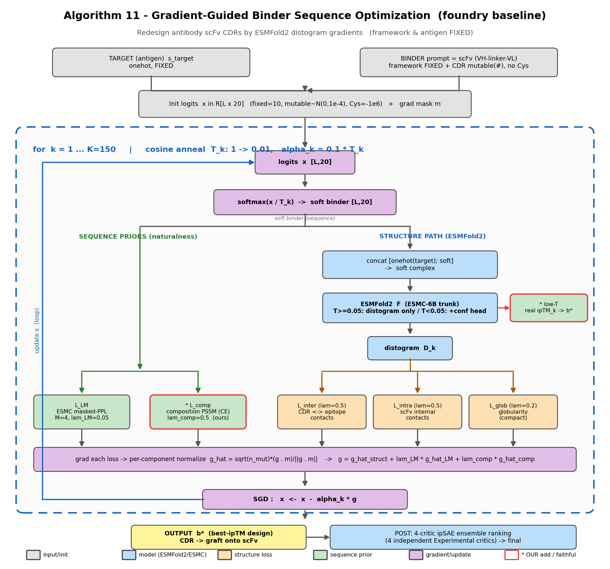
- **입력:** 항원(고정) + scFv(framework 고정 + CDR mutable). **init logits** → 매 step **softmax(x/T_k)** 로 soft 서열.
- **모델:** soft complex → **ESMFold2**(고온=distogram만 / 저온=+confidence head로 **real ipTM_k → b\***, ★우리 충실구현).
- **손실 = 구조 3종**(Inter/Intra/Glob, distogram 기반) **+ 시퀀스 prior**(LM masked-PPL **+ ★composition PSSM, 우리 추가**).
- **업데이트:** 성분별 gradient 정규화 → 결합 → **SGD** (cosine anneal로 K=150 반복) → **b\*** → **4-critic ipSAE 랭킹**.
- (빨간 테두리 = 우리가 추가/충실구현한 부분.)

---

## 2. 문제 1 — 충실 b\*가 품질을 못 올림 (전이 실패)

- 논문대로 **저온(T<0.05)에서 real confidence head로 진짜 ipTM**을 뽑아 best 설계 선택(b\*)하도록 구현.
- in-loop ipTM은 0.07(proxy)→**0.30~0.46**(real)로 크게 상승. 하지만 **최종 4-critic avg_ipsae는 그대로**(0.122 vs proxy 0.145, 둘 다 단일-critic 아티팩트).
- **해석:** 최적화가 distogram뿐 아니라 **confidence head까지 적대적으로 속임** → 설계모델의 ipTM이 **독립 critic으로 전이 안 됨**(over-confidence). → 병목은 b\* 선택이 아니라 **설계 현실성**.

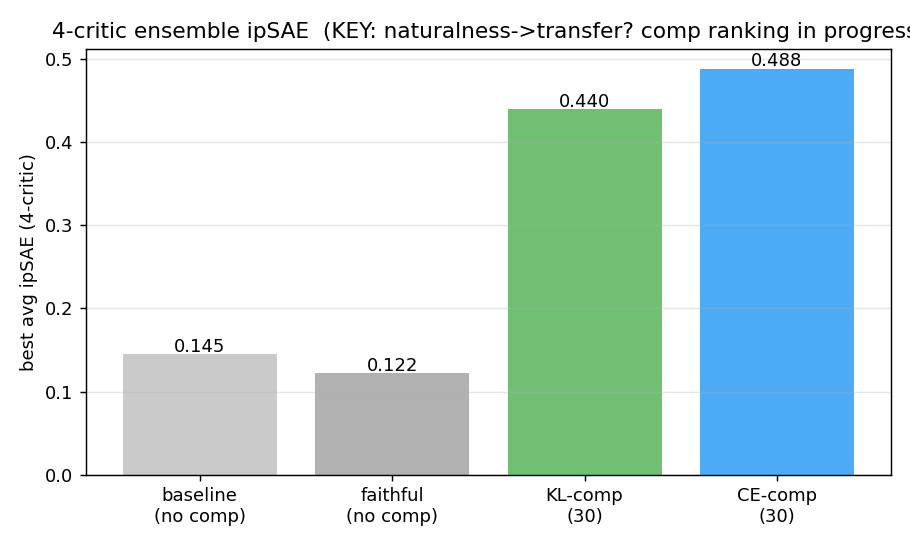

*(comp의 avg_ipsae는 랭킹 완료 시 갱신 — 자연성→전이 가설의 핵심 검증치)*

---

## 3. 문제 2 — "aromatic 범벅" 진단은 과장이었다 (정정)

- 초기에 설계 CDR을 보고 "W/Y/F 50-70% 범벅"이라 진단했으나, **실측하니 ~25%** (자연 항체 ~20%). 겨우 5%p 초과.
- → aromatic 과잉은 **주범이 아님**. 그러나 설계가 **위치별로 비자연적**(엉뚱한 위치·잔기)인 건 사실 → 이게 진짜 타깃.

---

## 4. 변경 — 자연 CDR 분포 prior (composition)

**아이디어:** 설계 CDR의 **위치별 AA 분포**가 *자연 항체 분포*에서 벗어나면 페널티.
- 손실: `L_comp = mean_pos( cross-entropy(p_pos, q_pos) )`. q_pos = **위치별 자연 분포(PSSM)**.
- **데이터 파이프라인:**
  - **TheraSAbDab(1,134) + OAS paired(60만)** VH/VL 서열을 **ANARCI(IMGT 넘버링)** 로 정렬,
  - 설계 CDR 위치를 같은 IMGT 위치에 매핑해 자연 AA 빈도 집계 → `q_target.npz` (위치당 support ~32,000).
  - OAS는 firewall 때문에 **Colab→Drive→노드** 로 확보. 넘버링은 별도 env(bioconda anarci)에서.

### 4.1 `.npz`에 뭐가 들었고, 어떻게 loss가 되나 (상세)

**(1) `.npz` 만드는 과정**
```
64,523개 자연 항체(OAS+TheraSAbDab) VH/VL
   → ANARCI 로 IMGT 넘버링 (서열마다 각 잔기에 IMGT 번호 부여)
   → 우리 설계 CDR 58개 위치를 같은 IMGT 번호에 매핑
   → 각 위치에서 20-AA가 몇 번 나왔는지 카운트 → 정규화
   → q_pos[i] = 위치 i 의 "자연 AA 확률분포" (합=1)
```

**(2) `q_target.npz` 내용물**
| 키 | shape | 의미 |
|---|---|---|
| `q_pos` | **[58, 20]** | **★ 위치별 자연 분포 q** (행 i = 위치 i, 20 AA 확률, 합 1) |
| `q_global` | [20] | 전체 CDR 평균 분포 (방향족 0.195) |
| `support` | [58] | 위치별 기여 항체 수 (~32,000) |
| `aa_order`, `cdr_names` | — | AA 순서 / 각 위치의 CDR 라벨 |

→ **이 `q_pos`가 곧 PSSM** (아래 히트맵). 위치마다 자연에서 어떤 AA가 흔한지.

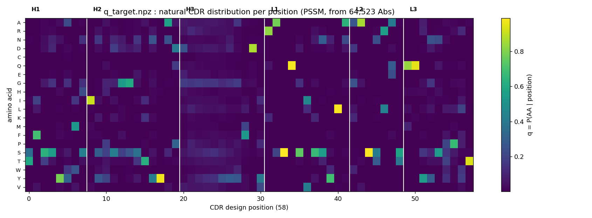
- 밝은 노랑 = 그 위치에 **한 AA가 지배적**(보존 위치, 예: 어떤 위치는 S/Q/I가 ~0.9).
- **H3 구간(20~30)은 어둡고 퍼짐 = 다양**(어느 AA든 가능). → 위치마다 분포가 완전히 다름.

**(3) p vs q — loss 계산**
- **q = 자연 분포(타깃, `.npz`, 고정)** / **p = 우리 설계 분포 = softmax(x/T)** (매 step 변함, 위치마다 20-벡터).
- 손실: 위치별 **Cross-Entropy** `CE(p, q) = −Σ_a p_a · log q_a`, 전 위치 평균.
- gradient가 설계 logits x를 갱신 → **p를 q(자연)쪽으로** 끎.

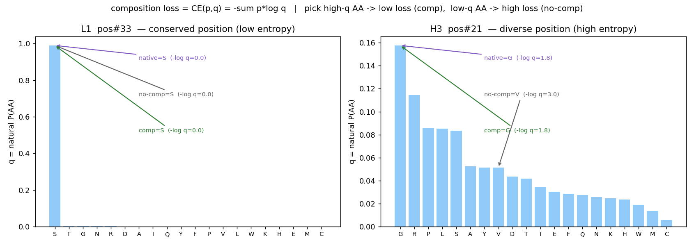
- **보존 위치(L1 #33):** q가 S에 ~0.99. 설계가 S 고르면 `−log q = 0` (손실 거의 0) → 쉽게 자연 따라감.
- **다양 위치(H3 #21):** q가 G(0.16)·R(0.11)·… 로 퍼짐. **comp는 G(−log q=1.8, 저손실)**, **no-comp는 V(−log q=3.0, 고손실)**. → comp가 자연에서 흔한 AA를 골라 손실↓.

> 즉 loss는 "설계가 각 위치에서 **자연에서 흔한 AA**를 고르도록" 압박. (q에 이미 자연 수준 다양성이 들어있어, 보존 위치는 강하게·다양 위치는 느슨하게 규제됨.)

---

## 5. 문제 3 — KL은 폭발한다 → Cross-Entropy

- `KL(p‖q) = CE(p,q) − H(p)`. 우리 p=softmax(x/T)는 annealing으로 **one-hot이 되며 H(p)→0**.
- KL의 `−H(p)` 항은 "p를 넓게 유지"를 강요 → **annealing과 충돌, 저온에서 폭발**.
- **CE(프로파일 NLL)** 는 엔트로피 항이 없어 안정 — "고른 AA가 자연에서 흔하게"로 깔끔하게 작동. (LM masked-PPL과 동형.)
- *경험적 메모:* KL도 **gradient 방향**은 자연 AA로 끌어서 **결과 설계는 자연스러웠음**(값만 폭발). → KL vs CE A/B로 실제 품질 차이 검증중.

---

## 6. 결과 — composition이 설계를 자연 항체로 끌어옴

### 6.1 방향족 분율: 자연 수준으로 하강
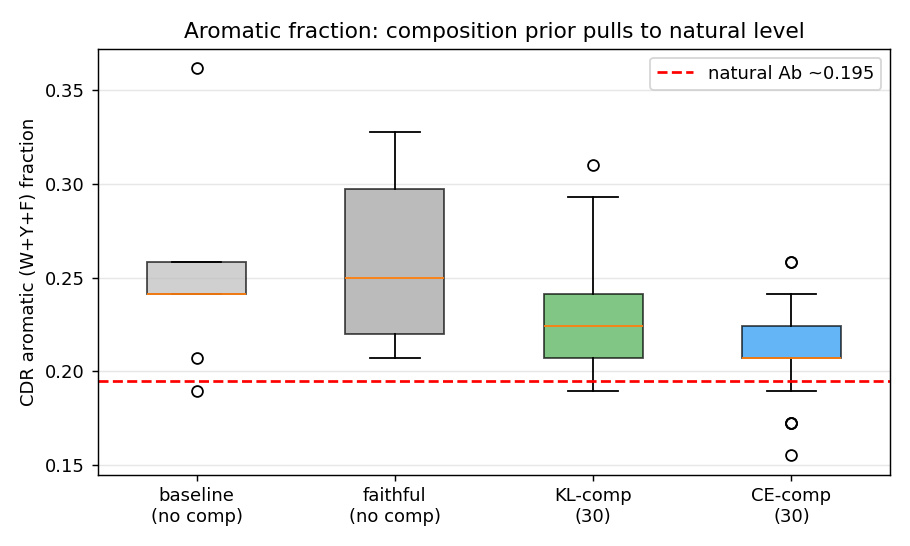
- no-comp 0.25 → **comp 0.23** (자연 0.195쪽). 분산도 감소.

### 6.2 위치별 자연성(NLL): 극적 개선
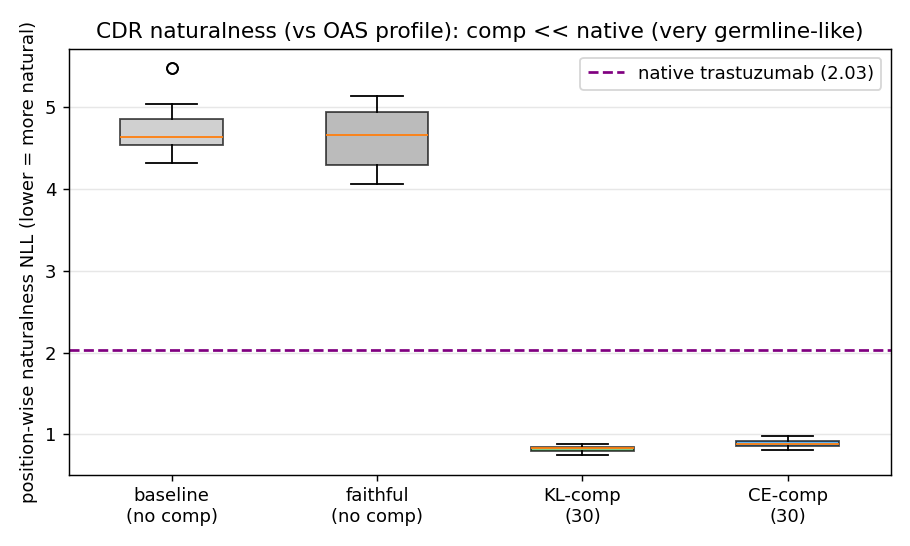
- no-comp **4.7** → comp **0.82** (낮을수록 자연). **native trastuzumab(2.03)보다도 낮음** = 매우 germline-같음.

### 6.3 CDR 서열: 정성적으로 "진짜 항체"
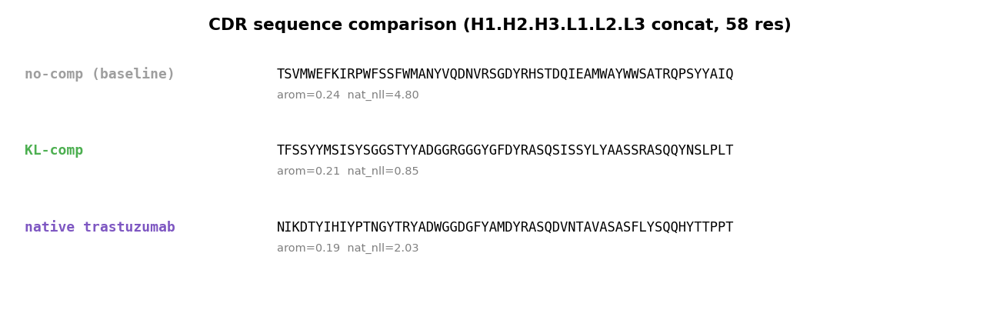
- no-comp: `TSLNQWFYTYYWWSPP…` (정체불명) → comp: `GFTFSSYYMS·…·RASQSISSYLY·…·QQYNSLPLT` (**germline canonical 패턴**).

**CDR별(H1~L3) 비교** (방향족 W/Y/F = 빨강):
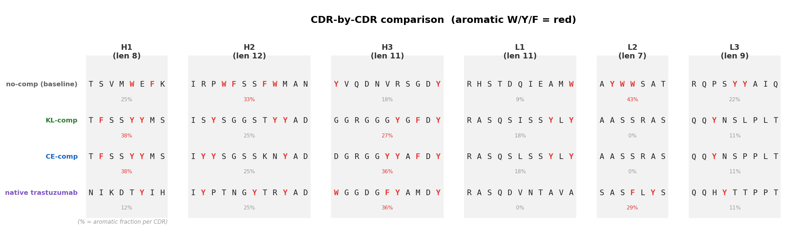
- **comp이 영역별로 germline canonical 패턴** 회복: H1 `TFSSYYMS`(GFTFSSYYMS germline), L1 `RASQSISS…`, L2 `AASSRAS`, L3 `QQ…PLT`.
- **no-comp는 영역 무시한 방향족 배치**: 예 **L2 `AYWWSAT` 43%**(자연 L2는 방향족 거의 0!), H2 33%. → comp이 *영역별 자연 분포*를 복원.

### 6.4 솔직한 caveat
- comp 설계가 **native보다 더 "전형적"(nat_nll 0.82<2.03)** = **germline 수렴** 신호. 자연스럽지만 **다양성↓·epitope 특이성 의문**.
- → **λ_comp 튜닝**(너무 세면 germline 복붙), **다양성 측정** 필요.

---

## 6.5 길이층화 자연 통계 (variable-length 설계 기반 데이터)

다음 단계(**trajectory마다 CDR 길이 다양화**)를 위해 자연 항체 12만개에서 **길이 분포 + 길이별 PSSM + 방향족 함량**을 사전 구축 (`data/length_pssm.npz`, 56개 길이별 PSSM).

### 길이 분포
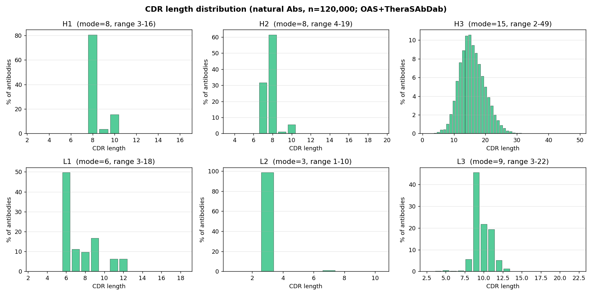
| CDR | 최빈 | 특성 |
|---|---|---|
| H1 | 8(81%) / H2 | 8(61%) — **거의 고정** |
| **H3** | **15(11%), 5~30 넓음** | **다양성 엔진 → 가변길이 핵심** |
| L1 6(50%) / L3 9(46%) | 부차 변동 | / **L2 3(99%) 사실상 고정** |

→ 가변길이는 **H3 우선**, H1/H2/L2는 고정해도 무방.

### H3 길이별 PSSM (같은 H3라도 길이마다 분포 다름)
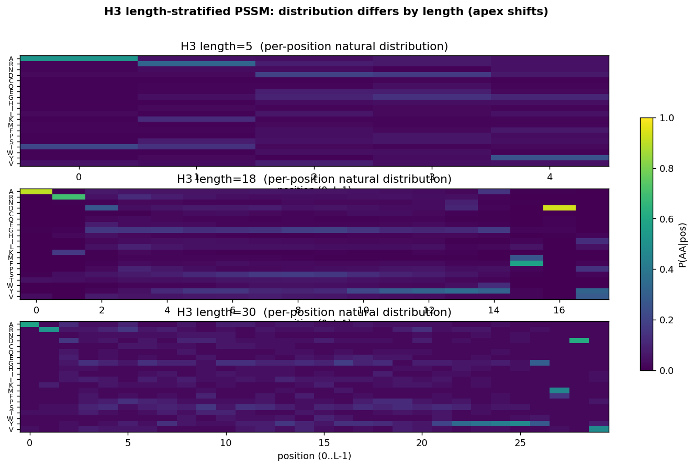

### ★ 방향족(W/Y/F) 함량 — 길이별
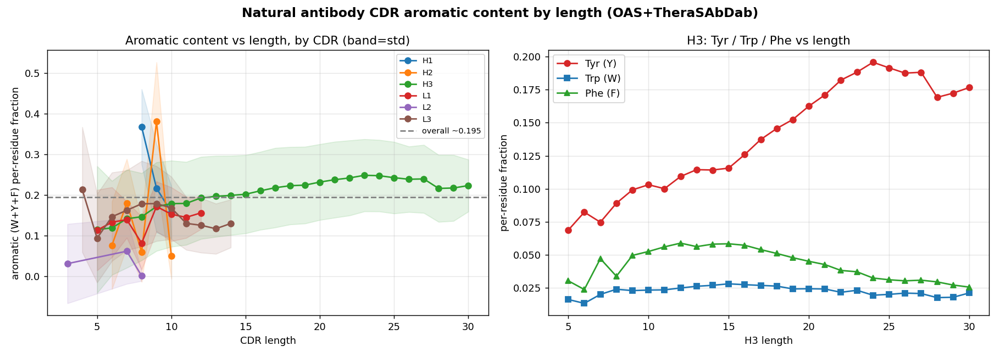
- 중쇄(H1/H2/H3) > 경쇄. **L2는 거의 0**(Ser 도배).
- **H3: 길수록 방향족↑(0.13→0.24), 거의 전부 Tyr** (Tyr 0.065→0.20; Trp 낮고 평평, Phe 중간).
- **함의:** 긴 H3는 자연적으로 Tyr-rich → 길이별 PSSM이 이를 반영해야 정확한 자연성 타깃.

---

## 7. ★ 결과 — composition이 critic 전이(ipSAE)를 3배 올림 (핵심 검증)

**30개씩 생성 → 4-critic ipSAE 랭킹** (baseline=이전 12개, comp=각 30개).

| batch | best ipSAE | mean ipSAE | naturalness NLL | pLDDT | 다양성(identity↓=다양) |
|---|---|---|---|---|---|
| baseline (no comp) | 0.145 | 0.038 | 4.95 | 74.4 | **0.33 (다양)** |
| **KL-comp** | 0.440 | **0.174** | 0.82 | 81.9 | 0.86 |
| **CE-comp** | **0.488** | 0.154 | 0.89 | 81.2 | 0.84 |

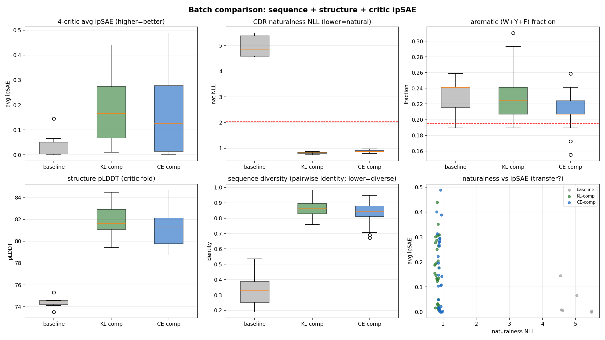
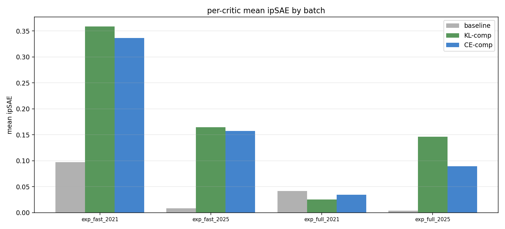

### 7.1 핵심 발견
1. **★ 자연성 → critic 전이 입증.** composition으로 설계를 자연화하니 **avg_ipsae가 baseline 대비 best 3배(0.145→0.44/0.49), mean 4.6배(0.038→0.17)**. "설계가 독립 critic으로 전이 안 되던" 병목이 **자연성으로 해소**.
2. **진짜 합의(consensus).** 최고 설계 **CE s108: 4 critic 모두 0.38~0.66** (baseline은 늘 1 critic만 반응하는 아티팩트였음). → 단일-critic 운이 아니라 **독립 모델들이 동의**.
3. **구조 신뢰도↑.** pLDDT 74→82.
4. **자연성↑.** nat_nll 4.95→0.85 (native 2.03보다도 낮음).

### 7.2 ★ 새 과제 — 다양성 붕괴 (germline 수렴)
- comp 30개가 **서로 84~86% 동일**(baseline 33%). = **germline consensus로 수렴** → 사실상 비슷한 설계 30개.
- 원인: composition이 *각 위치의 최빈 자연 AA*로 강하게 끎. → **품질↑ but 다양성↓** trade-off.

### 7.3 KL vs CE
- **거의 동등.** CE가 **단일 최고**(0.488 vs 0.440)·방향족 약간↓(0.213 vs 0.229)·미세하게 더 다양. KL이 **평균**(0.174 vs 0.154)·자연성 약간↑.
- **KL 손실값 폭발은 최종 품질에 무해**(gradient 방향이 자연 AA로 끌어서) — 단 CE가 곡선 안정·해석 용이해 **CE 권장**.

---

## 8. 다음 단계

1. **★ 다양성 회복 (최우선):** germline 수렴 완화 — **λ_comp 튜닝**(약하게), **variable CDR length**(H3 길이 trajectory별 샘플링 → 길이로 다양성 강제; 길이층화 PSSM 이미 구축됨 §6.5), 또는 다양성 보상 항.
2. **loss-rebalance:** λ_glob/intra↓ + per-CDR 가중치(H3 집중).
3. **항체 LM prior(AbLang2/IgLM):** 위치+문맥 자연성(composition 상위호환) — 위치 marginal보다 다양성 보존 가능성.
4. **검증 확대:** 더 많은 항원/타깃, ipSAE 외 지표(DockQ 등), 실제 발현·결합 검증.

---

## 부록 — 파이프라인
```
config → run.py: scFv 조립 + 인덱스
  → [생성] Algorithm 11: soft→ESMFold2 distogram→구조손실
        + ESMC LM prior + composition(자연 CDR 분포) → SGD → b*
  → [선택] 4-critic ipSAE 랭킹 → 최종
```
재현/데이터: `build_pssm.py`(PSSM), `download_oas_colab.py`(OAS), `composition.py`(손실), wandb `ESMCRAFT`.
